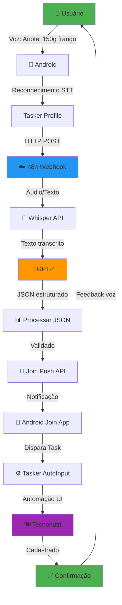
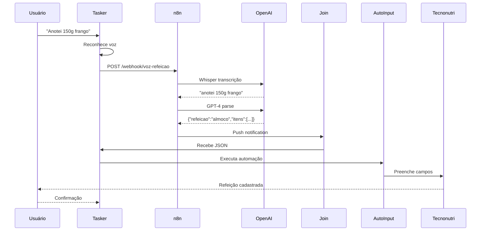
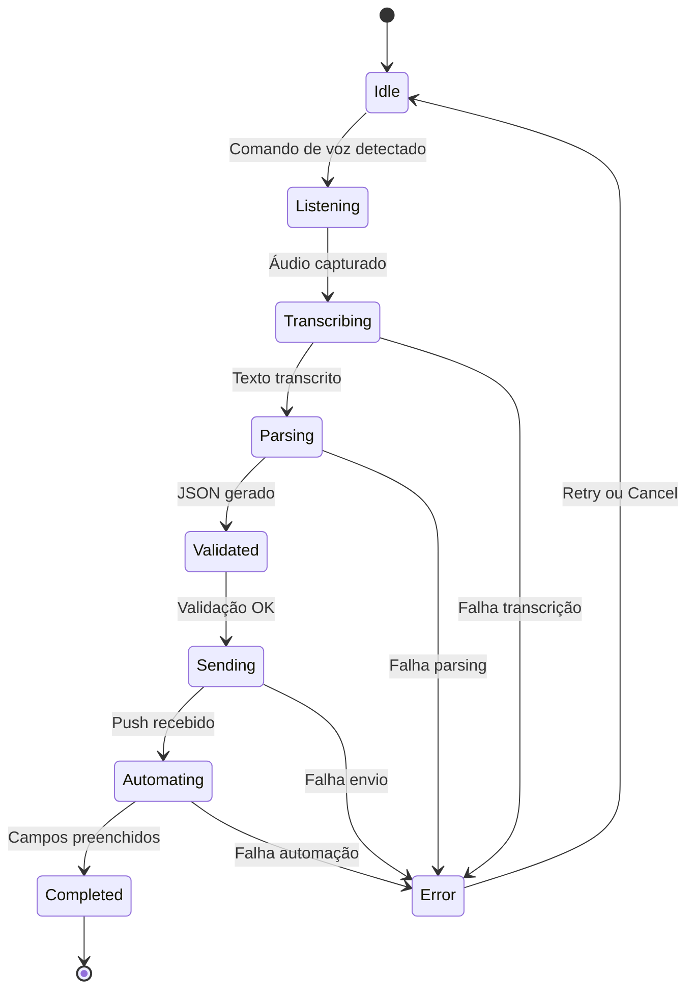

# 🎨 Assets

Diagramas, imagens e recursos visuais do projeto.

## 📋 Conteúdo

Este diretório contém:

- **Diagramas de arquitetura** - Fluxogramas do sistema
- **Screenshots** - Capturas de tela de exemplo
- **Logos e ícones** - Recursos visuais
- **Exemplos visuais** - Demonstrações de uso

## 🔄 Diagrama de Arquitetura (Mermaid)



## 📊 Fluxo de Dados



## 🖼️ Screenshots de Exemplo

### 1. Tasker - Perfil Ativo
```
[Imagem: Perfil "Comando de Voz" ativo no Tasker]
```

### 2. n8n - Workflow Executado
```
[Imagem: Workflow n8n com execução bem-sucedida]
```

### 3. Tecnonutri - Refeição Cadastrada
```
[Imagem: App Tecnonutri com refeição automaticamente preenchida]
```

## 📐 Componentes Visuais

### Arquitetura Simplificada

```
┌─────────────────────────────────────────────────────┐
│                    USUÁRIO (Voz)                    │
└────────────────────┬────────────────────────────────┘
                     │
                     ▼
┌─────────────────────────────────────────────────────┐
│                 ANDROID (Tasker)                    │
│  • Reconhecimento de voz                            │
│  • HTTP Client                                      │
│  • AutoInput automation                             │
└────────────────────┬────────────────────────────────┘
                     │
                     ▼
┌─────────────────────────────────────────────────────┐
│               N8N (Pipeline IA)                     │
│  • Webhook receiver                                 │
│  • Whisper transcription                            │
│  • GPT-4 parsing                                    │
│  • Join sender                                      │
└────────────────────┬────────────────────────────────┘
                     │
                     ▼
┌─────────────────────────────────────────────────────┐
│              OPENAI (IA Services)                   │
│  • Whisper STT                                      │
│  • GPT-4 NLP                                        │
└─────────────────────────────────────────────────────┘
                     │
                     ▼
┌─────────────────────────────────────────────────────┐
│            JOIN (Push Service)                      │
│  • Cloud messaging                                  │
│  • Device sync                                      │
└────────────────────┬────────────────────────────────┘
                     │
                     ▼
┌─────────────────────────────────────────────────────┐
│              TECNONUTRI (Target)                    │
│  • Meal registration                                │
│  • Food database                                    │
└─────────────────────────────────────────────────────┘
```

## 🎯 Estados do Sistema



## 📱 Interface do Usuário

### Flow de Uso

```
1. ATIVAÇÃO
   ┌────────────────┐
   │ Usuário fala   │
   │ comando        │
   └───────┬────────┘
           │
           ▼
   ┌────────────────┐
   │ Tasker captura │
   └───────┬────────┘

2. PROCESSAMENTO
   ┌────────────────┐
   │ Notificação:   │
   │ "Processando..." │
   └───────┬────────┘
           │
           ▼
   ┌────────────────┐
   │ n8n + IA       │
   │ trabalham      │
   └───────┬────────┘

3. EXECUÇÃO
   ┌────────────────┐
   │ App abre       │
   │ automaticamente│
   └───────┬────────┘
           │
           ▼
   ┌────────────────┐
   │ Campos são     │
   │ preenchidos    │
   └───────┬────────┘

4. CONFIRMAÇÃO
   ┌────────────────┐
   │ "Refeição      │
   │ cadastrada!"   │
   └────────────────┘
```

## 🔧 Componentes Técnicos

### Módulos do Sistema

```
taskers-meal-assistant/
│
├── 📱 ANDROID LAYER
│   ├── Tasker Profiles
│   │   ├── Voice triggers
│   │   ├── HTTP client
│   │   └── AutoInput tasks
│   └── Join Receiver
│       └── Push notifications
│
├── ☁️ CLOUD LAYER
│   ├── n8n Workflows
│   │   ├── Webhook endpoint
│   │   ├── AI orchestration
│   │   └── Join sender
│   └── OpenAI Services
│       ├── Whisper API
│       └── GPT-4 API
│
└── 🎯 TARGET LAYER
    └── Tecnonutri App
        ├── Food search
        ├── Quantity input
        └── Save meal
```

## 📊 Métricas e KPIs

```
┌─────────────────────────────────────┐
│      PERFORMANCE ESPERADA           │
├─────────────────────────────────────┤
│ Tempo de transcrição:    1-3s       │
│ Tempo de parsing:        0.5-1s     │
│ Tempo de automação:      5-10s      │
│ Total end-to-end:        10-15s     │
├─────────────────────────────────────┤
│ Taxa de sucesso:         >90%       │
│ Acurácia STT:           >95%        │
│ Acurácia parsing:       >85%        │
└─────────────────────────────────────┘
```

## 🎨 Paleta de Cores (UI Concept)

```css
/* Cores principais */
--primary: #4CAF50;      /* Verde - Sucesso */
--secondary: #2196F3;    /* Azul - Processar */
--warning: #FF9800;      /* Laranja - Aguardando */
--error: #F44336;        /* Vermelho - Erro */
--background: #FAFAFA;   /* Cinza claro */
--text: #212121;         /* Preto suave */
```

## 📦 Ícones Sugeridos

- 🎤 Microfone - Captura de voz
- 🤖 Robô - IA processando
- 🍽️ Prato - Refeição
- ✅ Check - Sucesso
- ⚠️ Alerta - Atenção
- ❌ X - Erro
- 📊 Gráfico - Analytics
- ⚙️ Engrenagem - Configuração

## 🚀 Como Adicionar Novas Assets

1. **Screenshots**: Formato PNG, 1080x1920 (portrait)
2. **Diagramas**: Use Mermaid ou draw.io
3. **Logos**: SVG preferencial, PNG com fundo transparente
4. **Ícones**: 512x512px, formato PNG ou SVG

---

**Nota**: Para contribuir com assets, veja [CONTRIBUTING.md](../CONTRIBUTING.md)
